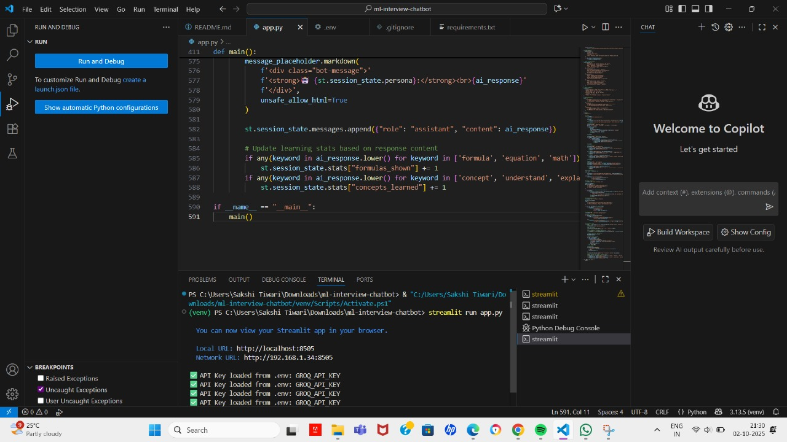

# ML Interview Pro 🤖

AI-powered ML interview preparation chatbot for freshers.

---

<div align="center">
  
</div>

<p align="center">
  
</p>

---

<div align="center">
[](https://streamlit.io/)
[](https://huggingface.co/)
[](./LICENSE)
[](https://github.com/Sakshi983-cmd/-pdf-qa-bot/stargazers)
</div>

<p align="center">
🤖 <b>ML Interview Pro</b><br>
Author: <b>Sakshi Tiwari</b>
</p>

---

## 🦾 Introduction

**ML Interview Pro** is a smart AI-powered interview preparation chatbot designed for Machine Learning freshers.  
It provides personalized guidance, code examples, formulas, and career tips in a fresher-friendly way.

> Unlock ML concepts, practice questions, and real-world insights effortlessly.

---

## 📊 System Workflow

### DEMO_ML Flow 1

```mermaid
graph TD
    A[User Query] --> B[Persona Selection]
    B --> C[LLM Processing]
    C --> D[Context-Aware Response]
    D --> E[Interactive Learning]
    E --> F[Progress Tracking]
    
    B --> G[👨‍🏫 Mentor]
    B --> H[👨‍💻 Coder]
    B --> I[📚 Teacher]
    B --> J[💼 Interviewer]

