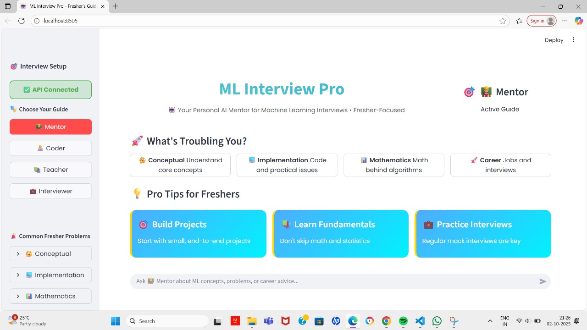

# ML Interview Pro 🤖

AI-powered ML interview preparation chatbot for freshers.

---

<div align="center">
  
</div>

<p align="center">
  
</p>

---

<div align="center">
[](https://github.com/Sakshi983-cmd/-pdf-qa-bot/stargazers)
</div>

<p align="center">
🤖 <b>ML Interview Pro</b><br>
Author: <b>Sakshi Tiwari</b>
</p>

---

## 🦾 Introduction

**ML Interview Pro** is a smart AI-powered interview preparation chatbot designed for Machine Learning freshers.  
It provides personalized guidance, code examples, formulas, and career tips in a fresher-friendly way.

> Unlock ML concepts, practice questions, and real-world insights effortlessly.

---

## 📊 System Workflow

```mermaid
graph TD
    %% DEMO_ML Flow 1
    A1[User Query] --> B1[Persona Selection]
    B1 --> C1[LLM Processing]
    C1 --> D1[Context-Aware Response]
    D1 --> E1[Interactive Learning]
    E1 --> F1[Progress Tracking]
    F1 --> Z[❌ ERROR: Progress Monitoring Failed]

    %% Persona Branches
    B1 --> G1[👨‍🏫 Mentor]
    B1 --> H1[👨‍💻 Coder]
    B1 --> I1[📚 Teacher]
    B1 --> J1[💼 Interviewer]

    %% Learning Analytics Flow
    A2[User Input] --> B2[Input Processing]
    B2 --> C2[LLM Engine]
    C2 --> D2[Response Generation]
    D2 --> E2[Learning Analytics]
    E2 --> J2[Concept Tracking]
    E2 --> K2[Progress Monitoring]
    K2 --> Z[❌ ERROR: Progress Monitoring Failed]

    %% NLP Subprocesses
    B2 --> F2[Tokenization]
    B2 --> G2[NLP Preprocessing]
    C2 --> H2[Transformer Model]
    C2 --> I2[Autoregressive Generation]
